# Database Schema

Local PostgreSQL schema for the CNG Station Management System.

**Status:** migrations written and verified against a local PostgreSQL 16 instance.
**Nothing hosted has been created or contacted.** No Supabase organization, no Supabase project,
no connection to any existing project, no imported data.

| | |
| --- | --- |
| Migrations | `supabase/migrations/0001`–`0016` |
| Scenario tests | `supabase/tests/schema_scenarios.sql` — **63 assertions, all passing** |
| Tables | 27 (all with RLS enabled) |
| Views | 8 |

Related: [`architecture.md`](./architecture.md) · [`decisions.md`](./decisions.md) ·
[`import-mapping.md`](./import-mapping.md) · [`data-quality-report.md`](./data-quality-report.md)

---

## 0. Hosted environment status — Prompt 4

**Status: BLOCKED — awaiting a manual dashboard action. No hosted resource has been created or
modified.**

| Item | Value |
| --- | --- |
| Supabase Organization | **not yet created** |
| Supabase Project | **not yet created** |
| Project reference | — |
| Region | — |
| Migrations applied to a hosted database | **none** |

### Pre-flight safety check (2026-09-14) — all nine points pass

| # | Check | Result |
| --- | --- | --- |
| 1 | Working directory | `/home/user/CNG-Station-Management` |
| 2 | Git remote | `theknight87/CNG-Station-Management`, branch `claude/stoic-noether-tu4jpm` |
| 3 | Supabase CLI link | **not linked** — no `supabase/.temp`, no `project-ref`, no `config.toml` |
| 4 | Stale project references | none. The only matches are the placeholder `VITE_SUPABASE_URL=` in `.env.example` and the two code references that read it. No project ref, host or connection string exists anywhere in the repository |
| 5 | Automatic reuse | impossible — nothing to reuse from |
| 6 | `.env` files | none present (only `.env.example`, placeholders) |
| 7 | Migrations | 16 present, correctly ordered `0001`–`0016` |
| 8 | Baseline re-verified | clean rebuild from zero: 27 tables, 27 with RLS, **63/63 assertions pass** |
| 9 | Isolation | **no Coding System resource was read, written, linked or contacted** |

### Blocker: no dedicated Organization can be created programmatically

The Supabase account contains exactly **one** organization:

| Organization | ID | Plan | Contents |
| --- | --- | --- | --- |
| `theknight87` | `zmfivitbfpthxnjtcdlr` | free | `sp-coding-system` (**the Coding System project — out of bounds**) |

That organization holds the Coding System project, so under the isolation rule it cannot host
this project. Creating a new organization is **not available through the Supabase Management API
or MCP tooling** — there is no create-organization operation; organizations can only be created
from the Supabase dashboard by the account owner.

Per the isolation rule, no existing organization is substituted, and no project was created.

### Minimal action required from the owner

1. Open <https://supabase.com/dashboard/org/_/new> (or Dashboard → organization switcher →
   **New organization**).
2. Name it **`CNG Station Management`**.
3. Confirm creation, then tell this session to continue.

Nothing else is needed: project creation, region selection, linking, migration and verification
are all automatable from there.

### Region recommendation (for when the organization exists)

Closest available Supabase regions to Egypt, from the currently offered set:

| Region | Location | Note |
| --- | --- | --- |
| **`eu-central-1`** | Frankfurt | **recommended** — lowest latency to Egypt of the available regions |
| `eu-west-3` | Paris | slightly further |
| `eu-south-*` | Milan/Spain | **not offered** by the current tooling |
| `ap-south-1` | Mumbai | further east, higher latency |

There is no Middle East or African region in the available set. Note that `sp-coding-system` also
sits in `eu-central-1`; **a shared region is not a shared resource** — it is a datacentre
location, and the projects remain entirely separate. If you prefer to avoid even that
coincidence, `eu-west-3` is the next best choice at a modest latency cost.

---

## 1. Migration files

| File | Contents |
| --- | --- |
| `0001_enums_and_helpers.sql` | 22 enum types; `cng_business_date()`, `cng_normalize_name()`, `cng_set_updated_at()` |
| `0002_core_hierarchy.sql` | `regions`, `stations`, `units`, `station_aliases`, `unit_aliases` |
| `0003_users_and_access.sql` | `app_users`, `user_region_access`, `cng_current_app_user_id()` |
| `0004_import_traceability.sql` | `import_batches`, `import_issues` |
| `0005_equipment.sql` | `compressors`, `recovery_tanks`, `storage_vessels`, `dispensers`, `gas_detectors`, `gas_detector_presence`, `hoses` |
| `0006_equipment_attributes_and_indexes.sql` | unit-level reported counts; equipment indexes; triggers |
| `0007_relief_valves.sql` | `installed_relief_valves`, `warehouse_relief_valves` |
| `0008_audit.sql` | `asset_mapping_audit`, `audit_logs` |
| `0009_alerts.sql` | `alert_rules`, `alerts`, `notification_preferences`, `push_subscriptions`, `notification_deliveries` |
| `0010_derived_functions.sql` | `cng_days_left()`, `cng_due_status()`, `cng_date_display()` |
| `0011_management_views.sql` | the seven management views |
| `0012_rls_enable.sql` | RLS enabled + forced on every table, deny-by-default |
| `0013_seed_reference_data.sql` | six regions; 30 default alert rules |
| `0014_mapping_lifecycle_enums.sql` | adds `needs_station_mapping` and `owner_confirmed` enum values (separate file: PostgreSQL will not let a new enum value be *used* until the adding transaction commits) |
| `0015_srv_station_mapping.sql` | nullable `station_id`; five-state lifecycle CHECK; raw source station evidence; `owner_confirmed_station_aliases`; `owner_confirmed_part_numbers`; their lookup functions; RLS for both |
| `0016_views_station_mapping.sql` | SRV views rebuilt for the lifecycle; adds `v_srv_mapping_queue` |

Ordering matters: `import_batches` precedes the asset tables so provenance is a real FK, and
`app_users` precedes everything that records an actor. Two FKs on `stations`/`units` are added
later by `ALTER TABLE` (to `app_users` and `import_batches`) because those tables are created
afterwards — the alternative would be a circular file order.

---

## 2. ERD

```mermaid
erDiagram
    regions  ||--o{ stations : contains
    stations ||--o{ units : contains
    regions  ||--o{ station_aliases : scopes
    stations ||--o{ station_aliases : "resolved by (confirmed only)"
    units    ||--o{ unit_aliases : "resolved by (confirmed only)"

    stations ||--o{ compressors : hosts
    stations ||--o{ recovery_tanks : hosts
    stations ||--o{ storage_vessels : hosts
    stations ||--o{ dispensers : hosts
    stations ||--o{ gas_detectors : hosts
    stations ||--o{ hoses : hosts
    stations ||--o{ gas_detector_presence : "presence evidence"

    units    |o--o{ compressors : "unit_id NULL until mapped"
    units    |o--o{ recovery_tanks : "unit_id NULL until mapped"
    units    |o--o{ storage_vessels : "unit_id NULL until mapped"
    units    |o--o{ dispensers : "unit_id NULL until mapped"
    units    |o--o{ gas_detectors : "unit_id NULL until mapped"
    units    |o--o{ hoses : "unit_id NULL until mapped"

    stations ||--o{ installed_relief_valves : "station always known"
    units    |o--o{ installed_relief_valves : "unit_id NULL until mapped"
    compressors     |o--o{ installed_relief_valves : "parent when resolved"
    storage_vessels |o--o{ installed_relief_valves : "parent when resolved"
    dispensers      |o--o{ installed_relief_valves : "parent when resolved"
    dispensers      |o--o{ hoses : "only after unit is known"

    regions  |o--o{ warehouse_relief_valves : "assignment target"
    stations |o--o{ warehouse_relief_valves : "assignment target"

    app_users ||--o{ user_region_access : grants
    regions   ||--o{ user_region_access : scopes
    app_users ||--o{ asset_mapping_audit : "changed_by (RESTRICT)"
    app_users ||--o{ audit_logs : actor
    app_users ||--o{ push_subscriptions : owns
    app_users ||--o{ notification_preferences : owns

    import_batches ||--o{ import_issues : produces
    alert_rules    ||--o{ alerts : generates
    alerts         ||--o{ notification_deliveries : "delivered as"
```



Note the shape of the SRV relationships: **`stations` is a mandatory parent, `units` and the
three equipment tables are optional.** That is the whole unresolved-record design in one line.

---

## 3. The unit-unknown pattern

Every unit-scoped asset carries the same three columns:

```sql
station_id      uuid NOT NULL,   -- proven by the source
region_id       uuid NOT NULL,   -- proven, kept consistent by composite FK
unit_id         uuid NULL,       -- unknown until a human maps it
mapping_status  asset_mapping_status NOT NULL
```

There is **no one-unit-per-station fallback** (decision D7). A station may legitimately hold
assets and zero units; that is a valid record, not an incomplete one.

Applies to: `compressors`, `recovery_tanks`, `storage_vessels`, `dispensers`, `gas_detectors`,
`hoses`, and — with a richer status enum — `installed_relief_valves`.

---

## 4. Composite foreign keys (hierarchy consistency)

23 of the 103 foreign keys are composite. They are the mechanism that keeps the hierarchy
consistent **declaratively, with no triggers at all**.

| On | Constraint | Guarantees |
| --- | --- | --- |
| `units` | `(station_id, region_id) → stations(id, region_id)` | a unit's region equals its station's |
| every asset table | `(station_id, region_id) → stations(id, region_id)` | an asset's region equals its station's |
| every asset table | `(unit_id, station_id) → units(id, station_id)` | an assigned unit belongs to the stated station |
| `installed_relief_valves` | `(compressor_id, unit_id) → compressors(id, unit_id)` | the parent compressor belongs to the stated unit |
| `installed_relief_valves` | `(storage_vessel_id, unit_id) → storage_vessels(id, unit_id)` | same for vessels |
| `installed_relief_valves` | `(dispenser_id, unit_id) → dispensers(id, unit_id)` | same for dispensers |
| `hoses` | `(dispenser_id, unit_id) → dispensers(id, unit_id)` | a hose's dispenser belongs to its unit |
| `warehouse_relief_valves` | `(target_station_id, target_region_id) → stations(id, region_id)` | assignment target is coherent |
| `unit_aliases` | `(unit_id, station_id) → units(id, station_id)` | an alias's unit belongs to its station |

**Why this works for unresolved records.** Under PostgreSQL's default `MATCH SIMPLE`, a composite
foreign key is **not checked when any of its columns is NULL**. So:

- `unit_id` NULL → the unit/station FK is dormant, and the asset is stored freely.
- a parent assigned → by CHECK, `unit_id` is set too, so the FK is live and the parent must
  provably sit in that unit.

Full strictness therefore applies **exactly** to resolved records, and no trigger is needed.
A bonus: re-parenting a unit to another station, or equipment to another unit, is *rejected*
rather than silently orphaning a resolved SRV.

Verified: `A2` (cross-unit compressor rejected), `C2` (cross-station unit rejected),
`X6` (unit/station region mismatch rejected).

---

## 5. Important CHECK constraints

### 5.1 SRV status ↔ shape (the central one)

```sql
CONSTRAINT irv_status_shape_ck CHECK (
  CASE mapping_status
    WHEN 'needs_station_mapping' THEN
      station_id IS NULL AND unit_id IS NULL
      AND num_nonnulls(compressor_id, storage_vessel_id, dispenser_id) = 0
    WHEN 'needs_unit_mapping' THEN
      station_id IS NOT NULL AND unit_id IS NULL
      AND num_nonnulls(compressor_id, storage_vessel_id, dispenser_id) = 0
    WHEN 'needs_equipment_mapping' THEN
      station_id IS NOT NULL AND unit_id IS NOT NULL
      AND num_nonnulls(compressor_id, storage_vessel_id, dispenser_id) = 0
    WHEN 'resolved' THEN
      station_id IS NOT NULL AND unit_id IS NOT NULL
      AND num_nonnulls(compressor_id, storage_vessel_id, dispenser_id) = 1
    WHEN 'conflict' THEN
      num_nonnulls(compressor_id, storage_vessel_id, dispenser_id) <= 1
  END
)
```

Each state names exactly what must be present *and* what must be absent, so the lifecycle can
only advance in order: a row cannot claim a Unit before its Station, or a parent before its Unit.
A companion constraint, `irv_unmatched_station_evidence_ck`, requires
`source_station_name_raw` whenever the status is `needs_station_mapping` — a station-less SRV can
never be anonymous.

Every unresolved state is self-describing: a NULL parent is never ambiguous, because the status
says whether it means "not yet mapped" or "evidence disputed". A half-mapped row can never read
as resolved, and a resolved row can never lack a parent.

This also makes `expected_parent_kind` **structurally incapable** of leaking into parentage: any
equipment FK on a non-resolved row is rejected (verified: `B3`).

### 5.2 Resolution must be attributable

```sql
CONSTRAINT irv_resolved_attribution_ck CHECK (
  mapping_status <> 'resolved' OR (resolved_by IS NOT NULL AND resolved_at IS NOT NULL)
)
```

A second line of defence against an automated backfill: a script cannot honestly name a human
resolver. Verified: `A5`.

### 5.3 Date precision

On every date triple, in every table:

```sql
CHECK ((next_calibration_precision = 'exact_date') = (next_calibration_date IS NOT NULL))
```

A biconditional, so it catches both failure directions: claiming exact precision with no date
(`H3`), and storing a real date while claiming `year_only` (`H4`) — which is exactly how a bare
`2021` would become a fabricated `2021-01-01`. 14 such constraints exist across 7 tables.

### 5.4 Other notable checks

| Constraint | Purpose |
| --- | --- |
| `*_resolved_ck` | `mapping_status = 'resolved'` requires `unit_id` (6 asset tables) |
| `*_needs_unit_ck` | `needs_unit_mapping` forbids `unit_id` |
| `hoses_dispenser_needs_unit_ck` | a dispenser cannot be attached while the unit is unknown (`G2`) |
| `station_aliases_confirmed_ck` | a **confirmed** alias must name a station and record who/when; a rejected one must not (`X3`) |
| `alert_rules_days_ck` | `days_before` present exactly for the countdown thresholds, absent for due-today/overdue |
| `irv_pressure_range_ck` | `pressure_min ≤ pressure_max` — ranges like `(275-344) BAR` cannot be inverted |
| `import_batches_completed_ck` | a terminal status must have `completed_at`, and vice versa |
| `import_issues_resolved_ck` | an open issue has no `resolved_at`; a closed one must |
| `ama_bulk_ck` | `is_bulk` and `bulk_batch_id` agree |
| `alerts_dedupe_uq` (unique) | one alert per asset/threshold/due date — a cron re-run cannot double-alert (`K3`) |
| `notif_delivery_uq` (unique) | one delivery per alert/user/channel — no double sends |

### 5.5 What is deliberately NOT constrained

- **No unique constraint on any serial number.** 38 SRV serials repeat across 224 rows, and a
  station may genuinely have six identical valves. Repeats are reported as duplicate candidates,
  never rejected (principle #16, verified `J`).
- **No NOT NULL on serial numbers.** 149 of 178 installed gas detectors have none.
- **No unique constraint on `units.job_number`.** Four job numbers appear on two units each.

---

## 5b. Owner-confirmed data rules

Two equivalences were explicitly confirmed by the system owner. They are the **only** things in
the system that may bypass human review, and both are stored as **data, not code** — one row per
confirmed value — so "what has the owner actually ruled on?" is answerable with a `SELECT`, and
any ruling can be listed, audited and reversed.

### `owner_confirmed_station_aliases`

| Column | Purpose |
| --- | --- |
| `source_name_raw` / `canonical_name_raw` | the exact pair, verbatim |
| `*_normalized` | generated via `cng_normalize_name()`, for exact lookup only |
| `region_code` | NULL = applies in any region |
| `confirmed_by_label`, `confirmed_on`, `note` | provenance of the ruling |

Seeded with one row: **`ابنوب` = `ابنوب اسيوط`**.

`cng_owner_confirmed_canonical(name, region)` is an **exact normalized match**. It is the entire
mechanism by which an alias may skip review; there is no other path.

> **This does not authorize generic governorate-suffix stripping.** There is no suffix rule, no
> regex, no similarity threshold anywhere in the schema. `ابو القمصان`, `ابو تيج- اسيوط` and
> `الادبيه - السويس` still return NULL and still require human confirmation — proved by assertion
> **L2**. A longer name that merely *contains* a confirmed one also returns NULL (**L3**).

The original source spelling is preserved regardless, in `source_station_name_raw` and
`source_raw` on the asset, and in `station_aliases.source_name_raw`.

### `owner_confirmed_part_numbers`

Seeded with one row: **`SS-4R3A`**, scoped to `installed_relief_valve`.

`cng_classify_identifier(raw, asset_type)` returns the `(serial_number, part_number)` pair to
store:

| Input | `serial_number` | `part_number` |
| --- | --- | --- |
| `SS-4R3A` (confirmed) | `NULL` | `SS-4R3A` |
| `0003262609` | `0003262609` | `NULL` |
| `SS-9X1B` (similar shape, unconfirmed) | `SS-9X1B` | `NULL` |

Shape is never evidence: only the enumerated value is reclassified (**M1–M3**). The raw cell
stays in `serial_number_raw` and in `source_raw`, with file/sheet/row provenance (**M4**).

## 6. Deletion behaviour

The rule: **nothing that carries evidence or history is ever cascade-deleted.**

| Relationship | Behaviour | Why |
| --- | --- | --- |
| `regions` ← everything | `RESTRICT` | the six regions are reference data; deleting one would orphan a hierarchy |
| `stations` ← `units`, all assets | `RESTRICT` | a station carries calibration history and imported evidence. Verified `X7`. Removal is `archived_at` (soft delete) |
| `units` ← assets | `RESTRICT` | same; also prevents orphaning a resolved SRV's parent chain |
| equipment ← `installed_relief_valves` | `RESTRICT` | deleting a compressor must not silently delete its safety relief valves |
| `import_batches` ← assets, `import_issues` | `RESTRICT` | provenance must survive; a batch cannot be erased while rows cite it |
| `app_users` ← `asset_mapping_audit.changed_by` | `RESTRICT` **and NOT NULL** | a mapping decision must remain attributable forever. A user who has made mappings cannot be deleted — deactivate with `is_active` instead |
| `app_users` ← `audit_logs.actor_id` | `RESTRICT` | same, with `actor_label` retained as a readable fallback |
| `app_users` ← `*.resolved_by`, `archived_by` | `SET NULL` | the asset must survive the person; the immutable record of the act is in the audit tables |
| `app_users` ← `user_region_access` | `CASCADE` | a grant is meaningless without its user, and the grant/revoke event is in `audit_logs` |
| `app_users` ← `push_subscriptions`, `notification_preferences` | `CASCADE` | per-user device state with no historical value |
| `alerts` ← `notification_deliveries` | `RESTRICT` | delivery history is evidence that someone was told |
| `alert_rules` ← `alerts` | `RESTRICT` | a rule cannot vanish under alerts it produced; disable with `is_enabled` |

**Soft delete** (`archived_at`, `archived_by`) exists on stations, units and every asset table.
All management views filter `archived_at IS NULL`, and partial indexes are scoped the same way.

**Polymorphic references** (`asset_mapping_audit.asset_id`, `alerts.asset_id`,
`import_issues.entity_id`) carry no FK, because one column cannot reference eight tables. This is
safe precisely because the asset tables use `RESTRICT` + soft delete: the target is never
silently removed. The trade-off is documented rather than hidden.

---

## 7. Date precision implementation

Three columns per date, everywhere:

```sql
next_calibration_raw        text NULL,             -- verbatim source: '2021', 'منتهية', '15/12/2025'
next_calibration_date       date NULL,             -- NULL unless precision = 'exact_date'
next_calibration_precision  date_precision NOT NULL DEFAULT 'unknown'
```

`date_precision` = `exact_date` | `year_only` | `unknown` | `invalid`.

Only `exact_date` can produce a number:

```sql
CREATE FUNCTION cng_days_left(p_date date, p_precision date_precision) RETURNS integer AS $$
  SELECT CASE WHEN p_precision = 'exact_date' AND p_date IS NOT NULL
              THEN (p_date - cng_business_date()) ELSE NULL END;
$$ LANGUAGE sql STABLE;
```

`cng_due_status()` returns `unknown` for every non-exact date — deliberately distinct from
`valid`, so an unknown date can never read as compliant *or* as overdue.
`cng_business_date()` is `(now() AT TIME ZONE 'Africa/Cairo')::date`, defined once so the
timezone appears in exactly one place.

A bare `2021` is stored as raw `'2021'`, date `NULL`, precision `year_only`, and renders as
"2021 (year only)" via `cng_date_display()`. It yields `days_left = NULL` and
`due_status = 'unknown'`, and **never generates an alert** (verified `H`, `H2`).

Excel `Days Left` columns are not imported at all — no column exists to hold them.

`source_status_raw` sits beside the triple and holds status words such as `منتهية` (decision D6):
visible as source evidence, never converted into a date or a computed compliance status.

---

## 8. Unresolved-record handling

| Source situation | Where it lives | Status |
| --- | --- | --- |
| **Station name not confirmable** | **`installed_relief_valves`** (the asset) **and** `import_issues` (the issue) | `needs_station_mapping`, `station_id NULL`, raw source station name required |
| Station confirmed, unit unknown | the asset table | `needs_unit_mapping`, `unit_id NULL` |
| Station + unit confirmed, SRV parent unknown | `installed_relief_valves` | `needs_equipment_mapping` |
| Sources disagree | the asset table | `conflict` — never treated as resolved |
| Detector explicitly absent | `gas_detector_presence` | `not_installed` — **no** `gas_detectors` row |

**An unmatched station no longer keeps an SRV out of the asset table.** `station_id` is nullable
and the lifecycle starts at `needs_station_mapping`. The asset belongs in
`installed_relief_valves`; the `unmatched_station` issue belongs in `import_issues`; both exist
(assertion **N8**). The SRV keeps its raw source station name, source region, `Location`,
`source_raw` and file/sheet/row provenance, and shows in Global SRV Management as
**Needs Station Mapping** with the source's own spelling — no Station is fabricated (**N1**,
**N6**).

### Lifecycle

```
needs_station_mapping --confirm station--> needs_unit_mapping
                      --confirm unit-----> needs_equipment_mapping
                      --confirm equipment-> resolved
                          (conflict: evidence-preserving side state)
```

Each transition is recorded in `asset_mapping_audit` with actor and timestamp (**P2**). The CHECK
constraint makes skipping a stage impossible: `resolved` without a unit or parent is rejected
(**P3**), and `needs_equipment_mapping` without a confirmed unit is rejected (**P4**). The full
path completes and the SRV then appears in the Unit tab, where it previously did not (**P5**,
**P6**). `v_srv_mapping_queue` orders the work station-first, since nothing below can proceed
until the station is confirmed (**P7**).

Expected outcome for the 2 662 installed SRVs: **`resolved` = 0.** The source proves a station
and a `Stage`/`Storage` hint, never a unit or a specific parent.

Unresolved records are fully live: searchable, visible in their global management module flagged
*Needs Mapping*, due-date tracked, and alertable. They are excluded from Unit tabs — `v_unit_srvs`
enforces the §29 rule in the database, so a UI mistake cannot show an unmapped valve inside a unit
it may not belong to (verified `D2`, `X1`, `X2`).

`station_aliases` and `unit_aliases` are the only authoritative resolution path. Rule-derived
proposals (governorate suffix, numbered unit) are inserted as **`proposed`** and must be confirmed
by a human before they resolve anything — the `station_aliases_confirmed_ck` constraint makes
"only confirmed aliases resolve" a database guarantee, not a convention (verified `X3`, `X4`).

---

## 9. Alert compatibility

`alert_rules.subject` covers all five subjects from the outset — SRV calibration, storage
inspection, recovery tank inspection, gas detector calibration, hose hydrotest — each with the six
default thresholds (60/30/15/7/due today/overdue). 30 rules are seeded. Adding an asset type later
needs rows, not a schema change.

**An unresolved SRV is alertable, at every lifecycle stage.** Alerting requires only that the
asset exists and has an exact next due date — **not** a confirmed station, unit or equipment.
`alerts.station_id` and `alerts.unit_id` are both nullable; `alerts.needs_mapping` and
`alerts.needs_station_mapping` tell the recipient what is unpinned, and
`alerts.source_station_name_raw` names the place using the source's own spelling rather than
fabricating a Station (verified `K`, `K2`, `O1`, `O2`).

Two unique constraints carry the anti-duplication story: `alerts_dedupe_uq` stops a cron re-run
producing a second alert for the same asset/threshold/due date (`K3`), and `notif_delivery_uq`
stops one alert being sent twice to the same user on the same channel.

Because `alerts.due_date` is `NOT NULL` and only exact-precision dates are scanned (the partial
due-date indexes are `WHERE ... precision = 'exact_date'`), a year-only date cannot reach the
alert table at all.

---

## 10. Indexes

134 indexes, each serving a named query. The pattern worth noting: **partial indexes matched to
the actual access path**.

| Purpose | Index | Why partial |
| --- | --- | --- |
| Region → Stations | `stations_region_idx` | `WHERE archived_at IS NULL` — views never read archived rows |
| Station → Units | `units_station_idx` | same |
| Unit → Equipment | `*_unit_idx` on 6 tables | same |
| Station → unresolved SRVs | `irv_station_unresolved_idx` | `WHERE mapping_status <> 'resolved'` — the mapping queue's main screen, and the index stays small as records get resolved |
| Mapping UI filter | `irv_expected_kind_idx` | only unresolved rows are ever filtered by hint |
| Due-date scanning | `*_due_idx` on 6 tables | `WHERE precision = 'exact_date'` — only these rows can alert, so the index excludes the 332 year-only cells entirely |
| Serial search | `*_serial_idx` | `WHERE serial_number IS NOT NULL` — most rows have none |
| Data Quality queues | `*_mapping_idx` | `WHERE mapping_status <> 'resolved'` |
| Alias resolution | `station_aliases_lookup_idx`, `..._confirmed_norm_uq` | the unique one is `WHERE alias_status = 'confirmed'`, allowing many competing proposals but one confirmed answer |
| User region access | `user_region_access_user_idx`, `..._region_idx` | RLS predicates in the auth phase |

---

## 11. Security notes

**RLS is enabled and FORCED on all 25 tables, with no permissive policies yet** — which in
PostgreSQL means deny-all for `anon` and `authenticated`. This is the safe ordering: a table can
never be exposed by an oversight between creation and policying, and later policies only widen
access from nothing. Full role × region policies come in the dedicated auth phase.

**No `SECURITY DEFINER` function exists.** Three helpers were candidates; all work as plain
`STABLE`/`IMMUTABLE` functions, so none was needed. Every function sets an explicit
`search_path = pg_catalog, public` regardless, so behaviour cannot be altered by a caller's
search path.

**All seven views are `WITH (security_invoker = true)`.** Without it a view runs with its
definer's rights and silently bypasses RLS on its base tables — a standard and serious Supabase
footgun. With it, every row a view returns is still filtered by the caller's own policies.

`push_subscriptions` holds per-browser subscription secrets (`p256dh`, `auth`). The project's
VAPID **private** key is not in the database at all; it lives only in Edge Function secrets.

---

## 12. Verification performed

Everything below was executed against a real PostgreSQL 16 instance created locally for this
purpose, then discarded. **No hosted resource was contacted.**

| Check | Result |
| --- | --- |
| All 16 migrations apply in order to an empty database | **pass** |
| Clean rebuild from zero (fresh database, migrations in filename order) | **pass** |
| Scenario suite `schema_scenarios.sql` | **63/63 assertions pass** |
| Seed correctness | 6 regions, 30 alert rules, 1 owner-confirmed alias, 1 owner-confirmed part number |
| RLS coverage | 27 of 27 tables have `rowsecurity = true`, asserted by test `X10` |
| Derived functions | `cng_days_left`, `cng_due_status`, `cng_date_display` return expected values incl. NULL cases |

### Scenario coverage (prompt §35)

| # | Scenario | Assertions | Result |
| --- | --- | --- | --- |
| A | Fully resolved compressor SRV | A, A2–A5 | pass — and cross-unit parent, two parents, no parent, and unattributed resolution are all **rejected** |
| B | Station known, unit unknown | B, B2, B3 | pass — and the hint cannot leak into an FK |
| C | Station + unit known, equipment unknown | C, C2 | pass |
| D | Conflicting evidence | D, D2 | pass — preserved, and never shown in a unit tab |
| E | Storage vessel, unit unknown | E, E2 | pass |
| F | Gas detector explicitly not installed | F, F2 | pass — no fake asset; absence visible with `detector_id NULL` |
| G | Hose, unit unknown | G, G2 | pass |
| H | Year-only date `2021` | H, H2, H3, H4 | pass — no Days Left, and a silent 1 January is rejected |
| I | Serial `0003262609` | I | pass — 10 characters, leading zeros intact |
| J | `SS-4R3A` in the serial column | J, J2 | pass — preserved, duplicated rows both kept, both queued for review |
| K | Unresolved SRV with an exact due date | K, K2, K3 | pass — alertable with `unit_id NULL`; duplicates rejected |
| X | Cross-cutting | X1–X10 | pass — unit tab contents, alias discipline, region coherence, delete protection, no unit fallback, RLS coverage |
| L | Owner-confirmed station alias | L1–L4 | pass — `ابنوب` resolves; **other suffixed names do not**; no substring matching |
| M | `SS-4R3A` classification | M1–M4 | pass — stored as `part_number` with `serial_number` NULL, raw + provenance intact; similar-looking values untouched |
| N | `needs_station_mapping` | N1–N8 | pass — NULL station allowed; unit/equipment FKs rejected; raw name required; visible globally; absent from unit tabs; asset and issue both stored |
| O | Due tracking without mapping | O1, O2 | pass — Days Left and status computed with no station; alert carries the raw name |
| P | Lifecycle transitions | P1–P7 | pass — station→unit→equipment→resolved; invalid jumps rejected; every transition audited |

To re-run:

```bash
createdb cng_check
for f in supabase/migrations/0*.sql; do psql -d cng_check -v ON_ERROR_STOP=1 -f "$f"; done
psql -d cng_check -f supabase/tests/schema_scenarios.sql     # rolls back; leaves no data
```

---

## 13. What cannot be verified without a hosted Supabase project

| Item | Why it needs the real project |
| --- | --- |
| **RLS policy behaviour** | Policies are not written yet, and the `anon`/`authenticated`/`service_role` roles and `request.jwt.claims` GUC are Supabase-provided. `cng_current_app_user_id()` is untested against a real Clerk JWT. |
| **Clerk ↔ Supabase JWT integration** | The JWT template, audience and signing configuration exist only in the hosted projects. The critical test — an unauthenticated client reads **zero** rows from every table — needs both. |
| **`gen_random_uuid()` provenance** | Available natively in PG 13+ here; on Supabase it may come from `pgcrypto`. Confirm the extension set on the real project. |
| **`pg_cron` scheduling** | The extension is not installed locally. Cron syntax and the Edge Function invocation path are untested. |
| **Performance at real volume** | Verified on an empty database. The 2 662-row SRV table and the union views need `EXPLAIN ANALYZE` against imported data, especially `v_vessel_management` (UNION ALL over two tables) and `v_data_quality_queue` (7-way UNION ALL). |
| **Supabase Advisors** | The security/performance linters run only against a hosted project. |
| **Timezone data** | `Africa/Cairo` resolves correctly locally; confirm the hosted instance agrees, including any future DST rule change. |
| **Generated-column behaviour under PostgREST** | `stations.normalized_name` and `units.normalized_name` are `GENERATED ALWAYS … STORED`; confirm PostgREST exposes them read-only as expected. |

---

## 14. Deviations and open points

**Resolved.** Earlier drafts treated two items as open conflicts between the Prompt 3 brief and
decisions D1/D4. The system owner has since confirmed both as authoritative business rules, and
the schema now implements them — narrowly, as enumerated data rather than as general rules:

1. **`ابنوب` = `ابنوب اسيوط`** is an owner-confirmed Station alias that bypasses review, seeded in
   `owner_confirmed_station_aliases`. **Generic governorate-suffix stripping is not implemented and
   is not authorized**; no suffix, pattern or similarity rule exists anywhere in the schema
   (asserted by L2/L3).

2. **`SS-4R3A` is a Part Number**, seeded in `owner_confirmed_part_numbers`. It normalizes into
   `part_number` with `serial_number` NULL, raw cell and provenance preserved. No other
   serial-looking or part-number-looking value is moved (asserted by M3).

3. **`installed_relief_valves.station_id` is now nullable**, with `needs_station_mapping` opening
   the lifecycle. An SRV whose station is unconfirmed is a real SRV record, not an import issue
   alone.

**Still worth flagging:**
- `alerts`, `asset_mapping_audit` and `import_issues` reference assets polymorphically without
  FKs. Mitigated by `RESTRICT` + soft delete on every asset table.
- Three questions remain open from the data analysis: the hose coverage gap for five regions,
  `16/8/3033`, and whether the 456 overdue vessel certificates are genuinely lapsed. None blocks
  the schema.
